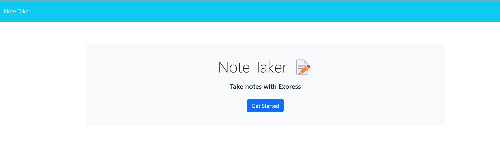
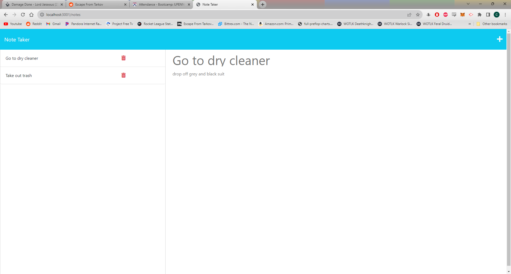

#  Note-taker

## Project Description
An app to take notes and organize them in list format. The user can enter in a note title and provide some text for additional explanation. The app will save the note to a file for storage and will pull the file back up for display when the user visits the site again. There is functionality to create new notes or delete notes that are no longer required. 

The front end javascript was provided for this challenge. The challenge was to insert the back-end functionality and link the back-end with the front-end.

### Screenshots

### links
https://github.com/cdziedzic/Note-pad
https://protected-citadel-40639-3d8d32fbfe01.herokuapp.com

## Table of contents

- [Installation](#installation)
- [Usage](#usage)
- [License](#license)
- [Contributing](#contributing)
- [Tests](#tests)
- [Questions](#questions)

### Installation
enter node.mjs into the terminal

### Usage 
For the creation of to-do lists

### License

### Questions

[My github](github.com/cdziedzic)

E-mail: cdziedzic@gmail.com

